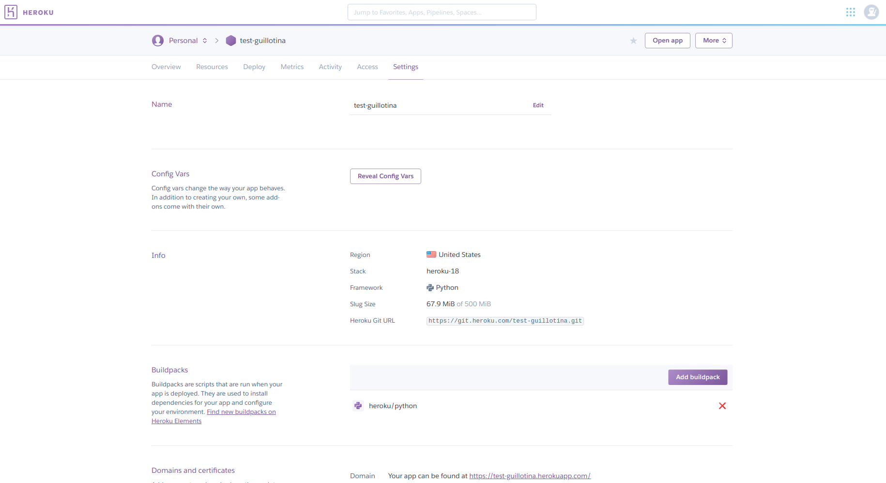
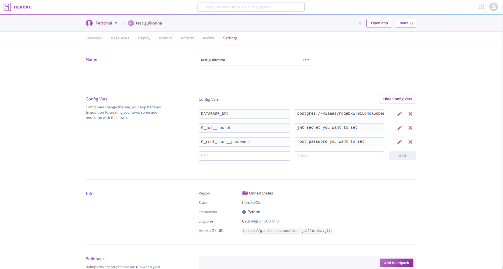

# Guillotina-heroku

Guillotina is the only full-featured Python AsyncIO REST Resource Application Server designed for high-performance, horizontally scaling solutions

Read more at [Guillotina](https://guillotina.readthedocs.io/en/latest/) 

Deploy Guillotina on Heroku with Postgres in one clicks

## Overridding configuration

You can add configuration variables, see https://guillotina.readthedocs.io/en/latest/developer/commands.html#overridding-configuration

### **Env variables you should customize for every deployment:**

- G_root_user__password
- G_jwt__secret

To change env var oh heroku

- Setting under application dashboard.

- Edit config var, click `Reveal Config Vars` and set `G_root_user__password`, `G_jwt__secret`

## Adding Cookiecutter template or editing config.yaml in deployment

- Install [heroku cli](https://devcenter.heroku.com/articles/heroku-cli) 
- In terminal `heroku login`
- `heroku git:clone -a <name_of_your_project>`
- `cd guillotina-test`
- Make changes in which you want on deployment.
- `git commit your changes`
- `git push heroku master`
